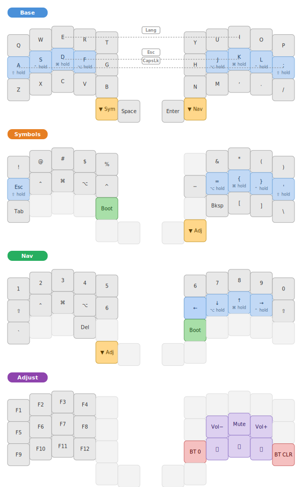

# kometa split kbd

ZMK firmware for the **Kometa** split keyboard: **nice!nano v2** + `kometa_left` / `kometa_right`.

**CI artifacts:** `kometa_left.uf2` (left), `kometa_right.uf2` (right), `settings_reset.uf2` (Bluetooth reset).

## Keymap (overview)

The layout follows the same **full-size-like QWERTY** philosophy: letters on **Base** follow standard QWERTY, punctuation on **Symbols** mirrors typical US placement, and **Nav** puts numbers and arrows where you would expect them on a standard board. Home row mods on **A S D F** / **J K L ;** are the main ergonomic adaptation; everything else stays familiar so switching from a laptop or desktop keyboard is straightforward.

Home row mods use **balanced** hold-tap (`hml` / `hmr`) on the letters **A S D F** and **J K L ;** (Shift / Ctrl / Gui / Alt as labeled in the map).

**Combos:** **Esc** (D+K), **Caps Lock** (A+;), and **Lang** (`LG(Space)`, E+I) — see `combos` in `config/kometa.keymap` for key positions.

&nbsp;

&nbsp;

| Layer | How you get there | Role |
|---|---|---|
| **Base** | Default | QWERTY; **left inner thumb** = hold **Symbols**; **right inner thumb** = hold **Nav**; thumbs share **Space** and **Enter** between them. |
| **Symbols** | Hold **left inner thumb** from Base | Punctuation and symbols; **Tab**; **Bootloader** on the left bottom block; right block includes **Backspace**; right outer thumb → **Adjust**. |
| **Nav** | Hold **right inner thumb** from Base | Numbers 1–0 on top row; arrows and navigation on home row (with mods); **Bootloader**; **Adjust** via **left inner thumb** (`mo 3`). |
| **Adjust** | From **Symbols** (right thumb) or **Nav** (left thumb) | **F1–F12**; **BT\_SEL 0** and **BT\_CLR**; volume and media keys. |
